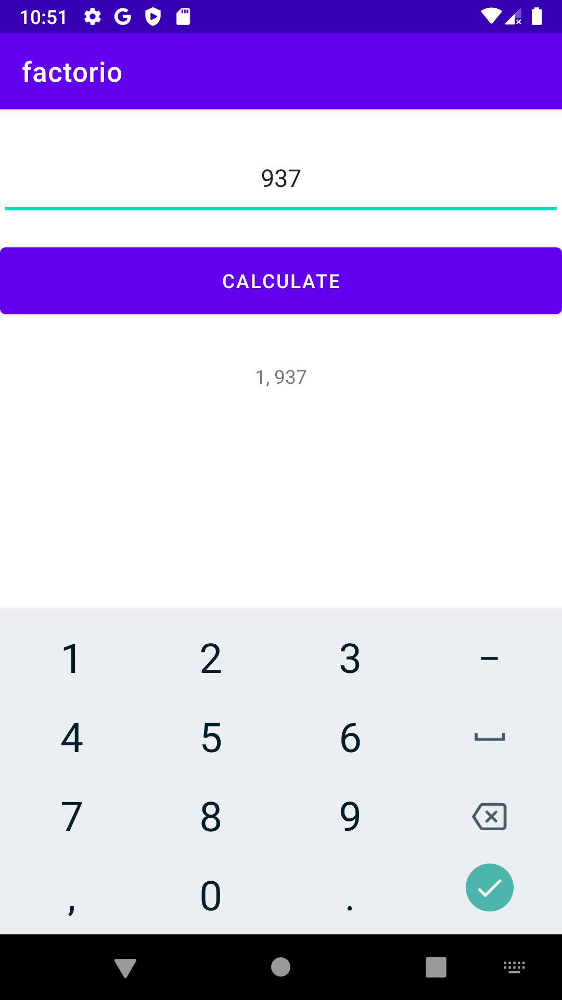

# Presentation

## Method
```kotlin
fun fermatFactorization(n: Int): List<Int>? {
    if (n % 2 == 0) return listOf(2, n / 2)
    if (n <= 0) return null

    var a = ceil(sqrt(n.toDouble()))
    var b = 0.0

    if (a * a == n.toDouble()) return listOf(a.toInt(), a.toInt())

    while(true) {
        val b1 = a * a - n
        b = floor(sqrt(b1))
        if (b1 == b * b) break else a++
    }

    return listOf((a - b).toInt(), (a + b).toInt())
}
```

### Screenshots:


